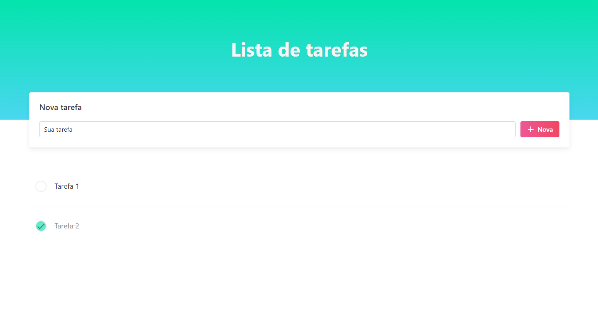
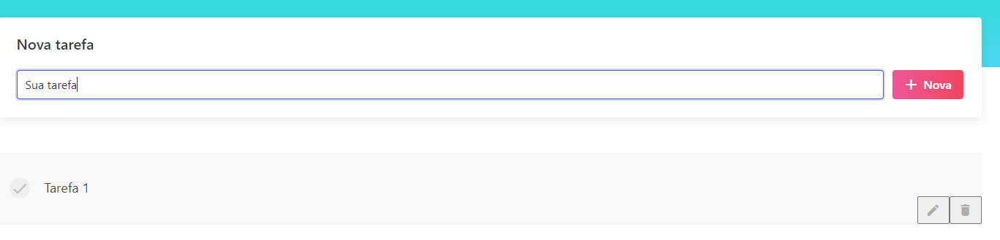

# Demo TodoMVC Angular

This project was generated with [angular-cli](https://github.com/angular/angular-cli).

## Screenshots of the application - (for assets embedding demo)

| Home page                             | About page                             |
| ------------------------------------- | -------------------------------------- |
|  |  |

It is a demo project for demonstrating my habilities with Angular:

-   architecture
-   components documentation
-   embedding images
-   documentating methods and properties of components, classes, interfaces, etc...

## Development server

Run `npm start` for a dev server. Navigate to `http://localhost:4200/`. The app will automatically reload if you change any of the source files.

## Code scaffolding

Run `ng generate component component-name` to generate a new component. You can also use `ng generate directive/pipe/service/class/module`.

